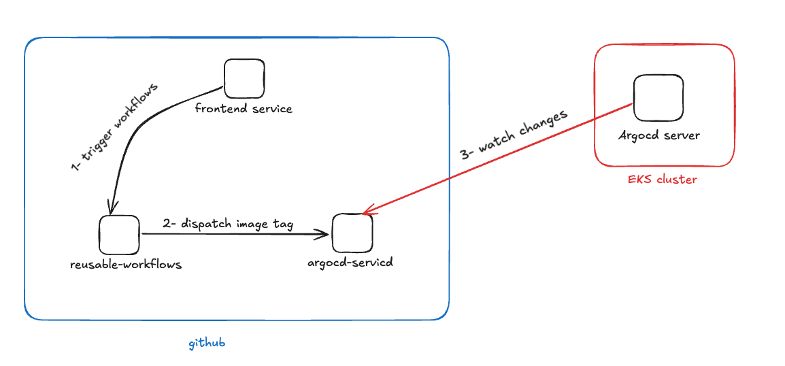

## About
This repo is just a simple app frontend for demo how to trigger a CICD pipeline

## Steps and CICD flow
- Create a release tag with [format](https://github.com/thienchuong/frontend/blob/main/.github/workflows/build-and-push.yaml#L5) begin with `v` for example: `v-xxx` or `canary-xxx`
  - v-xxx tag will trigger main app
  - canary-xxx will trigger canary app
- Github will trigger a [reusable-workflow](https://github.com/thienchuong/reusable-workflows/blob/main/.github/workflows/build-push.yaml)
- this reusable-workflow will do:
  - run ci test
  - run trivy test vulnerability
  - build docker image
  - push docker image
  - prepare value for workflow dispatch
  - deploy the dispatch ( send docker image tag to repo [argocd-service](https://github.com/thienchuong/argocd-service) )

## CICD flow diagram

